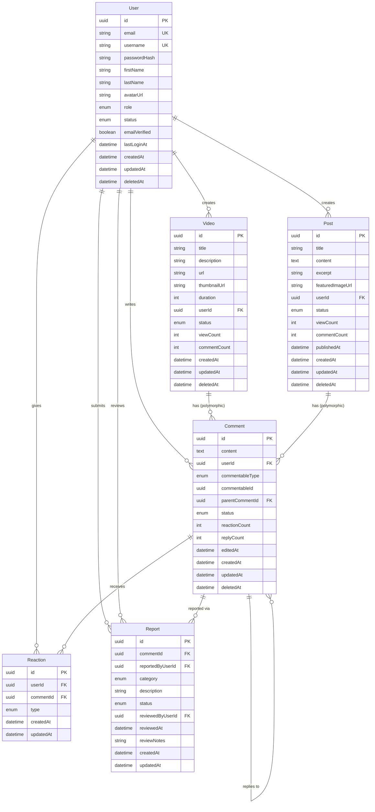

# Entity Relationship Diagram

This document contains the Entity Relationship Diagram (ERD) for the Commentable project database schema.

## Database Schema



## Entity Descriptions

### User
The User entity represents registered users in the system. Users can create videos, posts, comments, reactions, and reports.

**Key Features:**
- Supports multiple roles (Guest, User, Moderator, Admin)
- Email verification
- Soft delete capability
- Track last login

### Video
The Video entity represents video content that can receive comments.

**Key Features:**
- Polymorphic commentable entity
- Tracks view count and comment count for optimization
- Soft delete capability

### Post
The Post entity represents blog posts or social media posts that can receive comments.

**Key Features:**
- Polymorphic commentable entity
- Support for publishing workflow (draft/published)
- Tracks view count and comment count for optimization
- Soft delete capability

### Comment
The Comment entity implements a polymorphic commenting system with support for nested replies.

**Key Features:**
- **Polymorphic relationships**: Can be attached to Videos, Posts, or any commentable entity
- **Nested comments**: Supports threaded discussions via `parentCommentId`
- **Denormalized counts**: Stores reaction and reply counts to prevent N+1 queries
- Edit tracking with `editedAt` field
- Soft delete with status management

**Polymorphic Implementation:**
- `commentableType`: Enum specifying the entity type (Video, Post, etc.)
- `commentableId`: UUID referencing the specific entity

### Reaction
The Reaction entity represents user reactions to comments.

**Key Features:**
- Multiple reaction types (Like, Dislike, Love, Clap, Laugh, Sad)
- Composite unique constraint on (userId, commentId) to prevent duplicate reactions
- Users can change their reaction type

### Report
The Report entity tracks user reports of inappropriate comments.

**Key Features:**
- Categorized reporting (Spam, Harassment, Hate Speech, Violence, etc.)
- Moderation workflow (Pending → Reviewed → Resolved/Dismissed)
- Tracks who reviewed the report and when
- Optional review notes for internal moderation team

## Indexes

### Performance Optimization Indexes

```sql
-- User indexes
CREATE INDEX idx_users_email ON Users(email);
CREATE INDEX idx_users_username ON Users(username);
CREATE INDEX idx_users_role ON Users(role);

-- Video indexes
CREATE INDEX idx_videos_userId ON Videos(userId);
CREATE INDEX idx_videos_status ON Videos(status);
CREATE INDEX idx_videos_createdAt ON Videos(createdAt DESC);

-- Post indexes
CREATE INDEX idx_posts_userId ON Posts(userId);
CREATE INDEX idx_posts_status ON Posts(status);
CREATE INDEX idx_posts_publishedAt ON Posts(publishedAt DESC);
CREATE INDEX idx_posts_createdAt ON Posts(createdAt DESC);

-- Comment indexes (Critical for performance)
CREATE INDEX idx_comments_userId ON Comments(userId);
CREATE INDEX idx_comments_polymorphic ON Comments(commentableType, commentableId);
CREATE INDEX idx_comments_parentCommentId ON Comments(parentCommentId);
CREATE INDEX idx_comments_status ON Comments(status);
CREATE INDEX idx_comments_createdAt ON Comments(createdAt DESC);

-- Reaction indexes
CREATE UNIQUE INDEX idx_reactions_user_comment ON Reactions(userId, commentId);
CREATE INDEX idx_reactions_commentId ON Reactions(commentId);
CREATE INDEX idx_reactions_type ON Reactions(type);

-- Report indexes
CREATE INDEX idx_reports_commentId ON Reports(commentId);
CREATE INDEX idx_reports_status ON Reports(status);
CREATE INDEX idx_reports_reportedByUserId ON Reports(reportedByUserId);
CREATE INDEX idx_reports_reviewedByUserId ON Reports(reviewedByUserId);
CREATE INDEX idx_reports_category ON Reports(category);
```

## Cascade Delete Behavior

### User Deletion
When a user is deleted:
- **Videos**: Soft deleted (cascade)
- **Posts**: Soft deleted (cascade)
- **Comments**: Soft deleted (cascade)
- **Reactions**: Hard deleted (cascade)
- **Reports**: Preserved (set reportedByUserId to NULL)

### Video/Post Deletion
When a video or post is deleted:
- **Comments**: Soft deleted (cascade via application logic)

### Comment Deletion
When a comment is deleted:
- **Reactions**: Hard deleted (cascade)
- **Reports**: Preserved (comment remains for moderation history)
- **Reply Comments**: Preserved (orphaned replies show "[deleted]" parent)

## N+1 Query Prevention

### Denormalized Counts
To prevent N+1 queries, we maintain denormalized counts:

- **Video.commentCount**: Updated via triggers/application logic
- **Post.commentCount**: Updated via triggers/application logic
- **Comment.reactionCount**: Updated via triggers/application logic
- **Comment.replyCount**: Updated via triggers/application logic

### Eager Loading Strategies
When fetching comments:
1. Load comments with user data in a single query
2. Load reaction summaries separately (grouped query)
3. Load nested replies with recursive CTE or batched queries

## Caching Strategy

### Cache Keys Pattern
- User: `user:{id}`
- Video: `video:{id}`
- Post: `post:{id}`
- Comment: `comment:{id}`
- Comment List: `comments:{commentableType}:{commentableId}:page:{page}`
- Reaction Summary: `reactions:summary:{commentId}`

### Cache Invalidation
- **User updated**: Invalidate `user:{id}`
- **Comment created**: Invalidate comment lists for the commentable entity
- **Reaction created/updated**: Invalidate `reactions:summary:{commentId}` and `comment:{id}`
- **Comment deleted**: Invalidate comment lists and `comment:{id}`

## Design Patterns Applied

### Repository Pattern
Each entity has a corresponding repository interface:
- `IUserRepository`
- `IVideoRepository`
- `IPostRepository`
- `ICommentRepository`
- `IReactionRepository`
- `IReportRepository`

### Unit of Work Pattern
Coordinate multiple repository operations within a single transaction.

### Specification Pattern
Build complex queries dynamically for filtering and pagination.

### SOLID Principles
- **Single Responsibility**: Each entity has a focused purpose
- **Open/Closed**: Polymorphic comments allow extending to new commentable types
- **Liskov Substitution**: All commentable entities implement ICommentable interface
- **Interface Segregation**: Separate interfaces for different repository operations
- **Dependency Inversion**: Controllers depend on repository interfaces, not implementations
